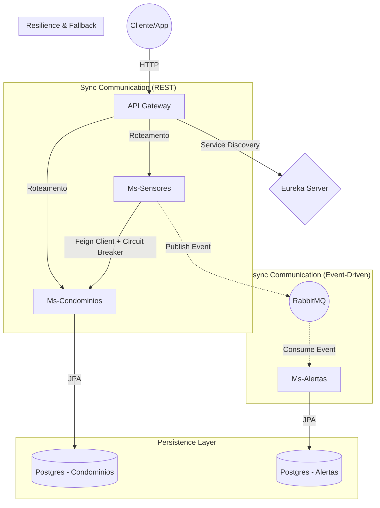

# 🏢 Ms-Jotave-Security


> **Sistema de Monitoramento e Segurança de Condomínios baseado em Arquitetura de Microsserviços.**

Este projeto é uma implementação robusta de um ecossistema de serviços distribuídos, demonstrando conceitos avançados de engenharia de software como **Service Discovery**, **API Gateway**, **Comunicação Assíncrona (Event-Driven)** e **Resiliência**.

---

## 📐 Arquitetura do Sistema

O sistema foi desenhado para ser desacoplado, escalável e resiliente a falhas. Abaixo, o fluxo de comunicação entre os componentes:



---

## 🛠️ Stack Tecnológica

O projeto utiliza as versões mais recentes e estáveis do ecossistema Spring:

*  Linguagem: Java 17
*  Framework Core: Spring Boot 3.3.0
*  Cloud & Discovery: Spring Cloud Netflix Eureka
*  Roteamento: Spring Cloud Gateway
*  Comunicação Síncrona: OpenFeign
*  Resiliência: Resilience4j (Circuit Breaker)
*  Mensageria: RabbitMQ (AMQP)
*  Banco de Dados: PostgreSQL 15
*  Gerenciamento de Banco: Flyway (Migrations)
*  Containerização: Docker & Docker Compose
*  Monitoramento: Spring Actuator

---
  
## 🚀 Como Rodar o Projeto

Graças à orquestração com Docker, você não precisa instalar Java, Postgres ou RabbitMQ na sua máquina. Basta ter o Docker e Docker Compose.

### Pré-requisitos

*  Docker Desktop instalado.
*  Git instalado.

---

#### Passo a Passo

1. Clone o repositório:

```bash
git clone https://github.com/jotave-erref/Ms-jotave-security.git
cd Ms-jotave-security
```

2. Suba a infraestrutura (Orquestração):

```bash
docker-compose up --build -d
```

3. Aguarde a inicialização:

```bash
docker-compose logs -f
```

---

## 🔍 Verificando os Serviços

Após iniciar, acesse:

| Serviço |	URL |	Descrição |
| :--- | :--- | :--- |
| **Eureka Server** |	http://localhost:8761 |	Painel de controle dos microsserviços ativos. |
| **RabbitMQ** |	http://localhost:15672 | User: guest Pass: guest. Monitoramento de filas. |
| **API Gateway** |	http://localhost:8080 |	Porta de entrada para as requisições. |

---

## 💡 Decisões de Design e Arquitetura

### 1. Database-per-Service (Banco por Serviço)
Cada microsserviço possui seu próprio banco de dados lógico (```condominiosdb```, ```alertasdb```) rodando em uma instância PostgreSQL containerizada. Isso garante desacoplamento de dados e evita que uma mudança de schema em um serviço quebre outro.

### 2. Event-Driven Architecture (EDA)

Para evitar acoplamento temporal entre a detecção do sensor e a geração do alerta, utilizamos o RabbitMQ.

* O ```ms-sensores``` apenas publica o evento "Movimento Detectado".
* O ```ms-alertas``` consome isso no seu próprio ritmo.
* **Benefício:** Se o serviço de alertas cair, as mensagens ficam salvas na fila e nada é perdido (DLQ e persistência).

### 3. Resiliência com Circuit Breaker
O ```ms-sensores``` precisa consultar o ```ms-condominios``` para saber qual apartamento pertence ao sensor. Se o serviço de condomínios estiver lento ou fora do ar:

* **O Circuit Breaker** abre, impedindo efeito cascata.
* Um mecanismo de **Fallback** é acionado para tratar a falha graciosamente.

### 4. 12-Factor App & Configuração Externalizada
Nenhuma senha ou IP está "chumbado" (hardcoded) no código. Utilizamos injeção de variáveis de ambiente via ```docker-compose.yml```, permitindo que a mesma imagem Docker rode em Dev, Teste e Prod apenas alterando as variáveis.

---

## 📡 Endpoints Principais
Todas as chamadas devem ser feitas através do Gateway (Porta 8080).

### Condomínios
```POST /condominios/apartamentos``` - Cadastra um apartamento.

```GET /condominios/apartamentos?page=0&size=10``` - Lista apartamentos (Paginado).

```POST /condominios/moradores``` - Cadastra um morador vinculado a um apartamento.

### Sensores
```POST /sensores/eventos``` - Recebe um sinal de hardware (IoT) e inicia o fluxo de alerta.

---

## 🚧 Desafios e Próximos Passos
Este projeto está em constante evolução. O roadmap futuro inclui:

* Segurança: Implementação de OAuth2/Keycloak no Gateway.
* Observabilidade: Tracing distribuído com Zipkin e Micrometer.
* Testes: Cobertura de testes unitários e de integração com TestContainers.

---

👨‍💻 Autor
Desenvolvido por Jean Victor (Jotavê) com foco em boas práticas e arquitetura de software.
