# 🏢 Ms-Jotave-Security


> **Sistema de Monitoramento e Segurança de Condomínios baseado em Arquitetura de Microsserviços.**

Este projeto é uma implementação robusta de um ecossistema de serviços distribuídos, demonstrando conceitos avançados de engenharia de software como **Service Discovery**, **API Gateway**, **Comunicação Assíncrona (Event-Driven)**, **Testes de Integração com Containers Reais** e **Resiliência**.

---

## 📐 Arquitetura do Sistema

O sistema foi desenhado para ser desacoplado, escalável e resiliente a falhas. Abaixo, o fluxo de comunicação entre os componentes:

```mermaid
flowchart TB
 subgraph subGraph0["Sync Communication (REST)"]
        MsCond["Ms-Condominios"]
        Gateway["API Gateway"]
        MsSensor["Ms-Sensores"]
  end
 subgraph subGraph1["Resilience & Fallback"]
  end
 subgraph subGraph2["Async Communication (Event-Driven)"]
        Rabbit(("RabbitMQ"))
        MsAlert["Ms-Alertas"]
  end
 subgraph subGraph3["Persistence Layer"]
        DB1[("Postgres - Condominios")]
        DB2[("Postgres - Alertas")]
  end
    User(("Cliente/App")) -- HTTP --> Gateway
    Gateway -- Service Discovery --> Eureka{"Eureka Server"}
    Gateway -- Roteamento --> MsCond & MsSensor
    MsSensor -- Feign Client + Circuit Breaker --> MsCond
    MsSensor -. Publish Event .-> Rabbit
    Rabbit -. Consume Event .-> MsAlert
    MsCond -- JPA --> DB1
    MsAlert -- JPA --> DB2

    style MsCond fill:#00C853
    style Gateway fill:#FF6D00
    style MsSensor fill:#00C853
    style Rabbit fill:#D50000
    style MsAlert fill:#00C853
    style DB1 fill:#BBDEFB,color:#00C853
    style DB2 fill:#BBDEFB,color:#00C853
    style User fill:#2962FF
    style Eureka fill:#FF6D00
    style subGraph1 fill:#D50000,stroke:#000000
    style subGraph0 fill:#000000
    style subGraph3 fill:#000000
    style subGraph2 fill:#000000
    linkStyle 0 stroke:#FFD600,fill:none
    linkStyle 1 stroke:#FFD600,fill:none
    linkStyle 2 stroke:#FFD600,fill:none
    linkStyle 3 stroke:#FFD600,fill:none
    linkStyle 4 stroke:#FFD600,fill:none
    linkStyle 5 stroke:#FFD600,fill:none
    linkStyle 7 stroke:#FFD600,fill:none
    linkStyle 8 stroke:#FFD600,fill:none
```



---

## 🧠 Padrões e Práticas de Engenharia (SOLID & Clean Code)

O projeto vai além do básico, implementando conceitos de arquitetura de software para garantir manutenibilidade:

### 1. Inversão de Dependência (DIP)
No `ms-sensores`, a regra de negócio não depende da implementação concreta do RabbitMQ.
*   **Abstração:** Interface `AlertaPublisher`.
*   **Implementação:** Classe `RabbitMQAlertaPublisher`.
*   **Benefício:** Permite trocar o RabbitMQ por Kafka ou AWS SQS sem alterar uma única linha da regra de negócio.

### 2. Database Migrations (Versionamento de Banco)
Utilizamos **Flyway** para gerenciar a evolução do banco de dados.
*   Nada de `hibernate.ddl-auto = update` em produção.
*   Todo o esquema é criado via scripts SQL versionados (`V1__criar_tabelas.sql`), garantindo consistência entre ambientes de Dev e Prod.

### 3. Fail-Fast & Bean Validation
Implementação de validações rigorosas na entrada da API (`@NotNull`, `@Pattern`).
*   O sistema rejeita requisições inválidas antes mesmo de processá-las, economizando recursos.

### 4. Tratamento Global de Erros
Utilização de `@RestControllerAdvice` para interceptar exceções em toda a aplicação.
*   **Padronização:** Todo erro retorna um JSON estruturado com Timestamp, Status HTTP correto (404, 400, 500) e detalhes amigáveis, evitando vazamento de stack traces para o cliente.

---

---

## 🧪 Estratégia de Testes (Destaque do Projeto)
Diferente de abordagens comuns que utilizam bancos em memória (H2) que não refletem a produção, este projeto adota Testcontainers para garantir fidelidade total nos testes de integração.

### 1. Testes de Integração "True-to-Life"
A cada execução de teste (`mvn test`), o projeto sobe automaticamente containers Docker descartáveis do **PostgreSQL** e **RabbitMQ**.

* No Ms-Condominios: Validamos persistência, constraints de banco e relacionamentos (FK) reais.
* No Ms-Sensores: Validamos a publicação correta na Exchange do RabbitMQ.
  
### 2. Testes de Consumidor Assíncrono (Ms-Alertas)
Utilizamos a biblioteca Awaitility para testar o fluxo completo:

1. Teste publica mensagem no RabbitMQ containerizado.
2. Listener consome em background.
3. Awaitility aguarda a persistência no Postgres containerizado.
4. Assertivas validam se o dado foi gravado corretamente.

---

## 🛠️ Stack Tecnológica

O projeto utiliza as versões mais recentes e estáveis do ecossistema Spring:

*  **Linguagem:** Java 17
*  **Framework Core:** Spring Boot 3.3.0
*  **Cloud & Discovery:** Spring Cloud Netflix Eureka
*  **Roteamento:** Spring Cloud Gateway
*  **Comunicação Síncrona:** OpenFeign
*  **Resiliência:** Resilience4j (Circuit Breaker)
*  **Mensageria:** RabbitMQ (AMQP)
*  **Banco de Dados:** PostgreSQL 15
*  **Gerenciamento de Banco:** Flyway (Migrations)
*  **Containerização:** Docker & Docker Compose
*  **Monitoramento:** Spring Actuator
*  **Gerenciamento de Banco:** Flyway (Migrations) - *Para controle de versão de schemas.*
*   **Qualidade de Código:** Jakarta Validation (Bean Validation) - *Para integridade de dados.*
*   **Tratamento de Erros:** Spring @RestControllerAdvice - *Para respostas HTTP consistentes.*

---
  
## 🚀 Como Rodar o Projeto

Graças à orquestração com Docker, você não precisa instalar Java, Postgres ou RabbitMQ na sua máquina. Basta ter o Docker e Docker Compose.

### Pré-requisitos

*  Docker Desktop instalado.
*  Git instalado.

---

#### Passo a Passo

1. Clone o repositório:

```bash
git clone https://github.com/jotave-erref/Ms-jotave-security.git
cd Ms-jotave-security
```

2. Suba a infraestrutura (Orquestração):

```bash
docker-compose up --build -d
```

3. Aguarde a inicialização:

```bash
docker-compose logs -f
```

---

## 🔍 Verificando os Serviços

Após iniciar, acesse:

| Serviço |	URL |	Descrição |
| :--- | :--- | :--- |
| **Eureka Server** |	http://localhost:8761 |	Painel de controle dos microsserviços ativos. |
| **RabbitMQ** |	http://localhost:15672 | User: guest Pass: guest. Monitoramento de filas. |
| **API Gateway** |	http://localhost:8080 |	Porta de entrada para as requisições. |

---

## 💡 Decisões de Design e Arquitetura

### 1. Database-per-Service (Banco por Serviço)
Cada microsserviço possui seu próprio banco de dados lógico (```condominiosdb```, ```alertasdb```) rodando em uma instância PostgreSQL containerizada. Isso garante desacoplamento de dados e evita que uma mudança de schema em um serviço quebre outro.

### 2. Event-Driven Architecture (EDA)

Para evitar acoplamento temporal entre a detecção do sensor e a geração do alerta, utilizamos o RabbitMQ.

* O ```ms-sensores``` apenas publica o evento "Movimento Detectado".
* O ```ms-alertas``` consome isso no seu próprio ritmo.
* **Benefício:** Se o serviço de alertas cair, as mensagens ficam salvas na fila e nada é perdido (DLQ e persistência).

### 3. Resiliência com Circuit Breaker
O ```ms-sensores``` precisa consultar o ```ms-condominios``` para saber qual apartamento pertence ao sensor. Se o serviço de condomínios estiver lento ou fora do ar:

* **O Circuit Breaker** abre, impedindo efeito cascata.
* Um mecanismo de **Fallback** é acionado para tratar a falha graciosamente.

### 4. 12-Factor App & Configuração Externalizada
Nenhuma senha ou IP está "chumbado" (hardcoded) no código. Utilizamos injeção de variáveis de ambiente via ```docker-compose.yml```, permitindo que a mesma imagem Docker rode em Dev, Teste e Prod apenas alterando as variáveis.

### 5. Validação Forte (Bean Validation)
Uso extensivo de `Jakarta Bean Validation` (`@NotBlank`, `@NotNull`, `@Size`) nos DTOs de entrada para impedir "sujeira" no sistema logo na camada de Controller.

---

## 📡 Endpoints Principais
Todas as chamadas devem ser feitas através do Gateway (Porta 8080).

### Condomínios
```POST /condominios/apartamentos``` - Cadastra um apartamento.
```json
{
    "numero": "111",
    "bloco": "A"
}
```

```GET /condominios/apartamentos?page=0&size=10``` - Lista apartamentos (Paginado).

```POST /condominios/moradores``` - Cadastra um morador vinculado a um apartamento.
```json
{
    "nome": "Jotavê",
    "cpf": "12345678910",
    "apartamentoId": 1
}
```

### Sensores
```POST /sensores/eventos``` - Recebe um sinal de hardware (IoT) e inicia o fluxo de alerta.
```json
{
    "sensorId": "1",
    "status": "ABERTO",
    "timestamp": "2025-12-05T03:30:00" 
}
```

### 🛡️ Exemplo de Tratamento de Erros

O sistema possui respostas de erro padronizadas. Tentar criar um sensor sem ID resulta em **400 Bad Request**:

```json
{
  "timestamp": "2023-12-02T15:30:00",
  "status": 400,
  "erro": "Dados inválidos",
  "detalhes": {
    "sensorId": "The sensor ID is required",
    "status": "Status must be ABERTO or FECHADO!"
  }
}
```
---

## 🚧 Desafios e Próximos Passos
Este projeto está em constante evolução. O roadmap futuro inclui:

* Segurança: Implementação de OAuth2/Keycloak no Gateway.
* Observabilidade: Tracing distribuído com Zipkin e Micrometer.

---

👨‍💻 Autor
Desenvolvido por Jean Victor (Jotavê) com foco em boas práticas e arquitetura de software.
