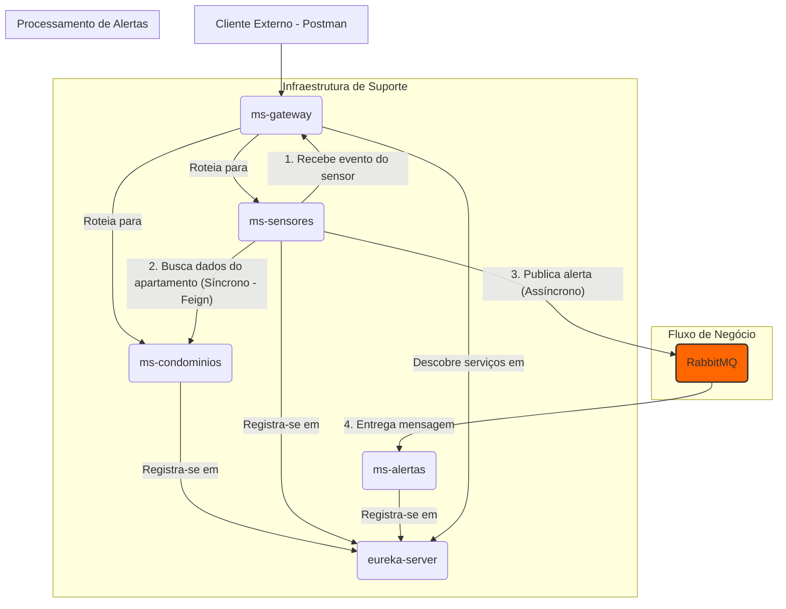

# 🚀 Sistema de Monitoramento de Sensores de Condomínio

Este projeto de estudo demonstra a implementação de uma arquitetura de microsserviços completa, reativa e resiliente, utilizando Java com o ecossistema Spring Boot e Spring Cloud. O sistema simula o monitoramento em tempo real de sensores em um condomínio, processando eventos e gerando alertas de forma desacoplada e escalável.

O principal objetivo foi aprofundar os conhecimentos em padrões de arquitetura distribuída, explorando desde a descoberta de serviços e roteamento de borda até a comunicação assíncrona com mensageria, sendo esta a primeira implementação prática com **RabbitMQ**.

## 🏛️ Arquitetura do Sistema

O sistema é composto por 5 microsserviços principais que trabalham em conjunto para formar uma plataforma coesa e resiliente.


```mermaid
graph TD
    A[Cliente Externo - Postman] --> B(ms-gateway);

    subgraph "Infraestrutura de Suporte"
        B(ms-gateway) -- Roteia para --> C(ms-condominios);
        B(ms-gateway) -- Roteia para --> D(ms-sensores);
        C -- Registra-se em --> E(eureka-server);
        D -- Registra-se em --> E(eureka-server);
        F -- Registra-se em --> E(eureka-server);
        B -- Descobre serviços em --> E(eureka-server);
    end

    subgraph "Fluxo de Negócio"
        D -- 1. Recebe evento do sensor --> B;
        D -- 2. Busca dados do apartamento (Síncrono - Feign) --> C;
        D -- 3. Publica alerta (Assíncrono) --> G(RabbitMQ);
    end
    
    subgraph "Processamento de Alertas"
         G(RabbitMQ) -- 4. Entrega mensagem --> F(ms-alertas);
    end

    style G fill:#ff6600,stroke:#333,stroke-width:2px
```

### Detalhes dos Microsserviços

#### 📦 `eureka-server`
*   **Responsabilidade:** Service Discovery. Atua como o "catálogo de endereços" da arquitetura, permitindo que os serviços se encontrem dinamicamente sem a necessidade de hardcoding de IPs e portas.

#### 🚪 `ms-gateway`
*   **Responsabilidade:** API Gateway. É o ponto de entrada único para todas as requisições externas. Centraliza responsabilidades como roteamento, segurança (futuramente) e balanceamento de carga, simplificando a comunicação para os clientes.

#### 🏢 `ms-condominios`
*   **Responsabilidade:** Serviço de Cadastro. Gerencia os dados mestres do sistema, como apartamentos e moradores. Atua como a fonte da verdade para informações cadastrais.
*   **Endpoints Principais:** `POST /apartamentos`, `POST /moradores`, `GET /apartamentos/por-numero`.

#### 📡 `ms-sensores`
*   **Responsabilidade:** Serviço de Eventos. Recebe "pings" dos sensores, enriquece os dados consultando o `ms-condominios` (via Feign Client) e, ao detectar um evento suspeito, publica uma mensagem de alerta no RabbitMQ.
*   **Endpoints Principais:** `POST /eventos`.

#### 🔔 `ms-alertas`
*   **Responsabilidade:** Serviço de Notificação. É o consumidor das mensagens de alerta. Ele escuta a fila do RabbitMQ e, ao receber uma nova mensagem, tem a responsabilidade de processá-la (atualmente, imprime no console, mas futuramente persistirá no banco de dados).

## ✨ Tecnologias Utilizadas

| Categoria                | Tecnologia                                           |
| ------------------------ | ---------------------------------------------------- |
| **Linguagem & Framework**  | Java 17, Spring Boot 3.x                             |
| **Ecossistema Spring**     | Spring Cloud, Spring Data JPA, Spring AMQP, Spring Web |
| **Comunicação Síncrona**   | REST, OpenFeign                                      |
| **Comunicação Assíncrona** | RabbitMQ (Mensageria)                                |
| **Infraestrutura**         | Eureka (Service Discovery), Spring Cloud Gateway     |
| **Banco de Dados**         | H2 (Banco em memória para desenvolvimento)           |
| **Build & Dependências**   | Maven                                                |
| **Containerização**        | Docker                                               |

## ⚙️ Como Executar o Projeto

Siga os passos abaixo para configurar e rodar o ambiente completo localmente.

### Pré-requisitos
*   **Java 17** ou superior
*   **Maven 3.8** ou superior
*   **Docker** e **Docker Desktop** em execução

### 1. Iniciar a Infraestrutura (RabbitMQ)

O RabbitMQ é o único componente que precisa ser iniciado via Docker. Execute o comando abaixo no seu terminal:

```bash
docker run -d --name meu-rabbitmq -p 5672:5672 -p 15672:15672 rabbitmq:3-management
```
*   A aplicação estará disponível em `localhost:5672`.
*   A interface de gerenciamento estará em `http://localhost:15672` (usuário: `guest`, senha: `guest`).

### 2. Iniciar os Microsserviços

A ordem de inicialização é importante. Inicie cada serviço em um terminal separado.

1.  **Eureka Server:**
    ```bash
    cd eureka-server
    mvn spring-boot:run
    ```
2.  **MS-Condominios:**
    ```bash
    cd ms-condominios
    mvn spring-boot:run
    ```
3.  **MS-Alertas:**
    ```bash
    cd ms-alertas
    mvn spring-boot:run
    ```
4.  **MS-Sensores:**
    ```bash
    cd ms-sensores
    mvn spring-boot:run
    ```
5.  **MS-Gateway:**
    ```bash
    cd ms-gateway
    mvn spring-boot:run
    ```

Após alguns instantes, você pode verificar o painel do Eureka em `http://localhost:8761` para ver todos os serviços registrados.

## 🚀 Testando o Fluxo Completo

Todas as requisições devem ser feitas para a porta do **API Gateway (`8080`)**.

### 1. Criar um Apartamento
```bash
curl --location 'http://localhost:8080/condominios/apartamentos' \
--header 'Content-Type: application/json' \
--data '{
    "numero": "101",
    "bloco": "A"
}'
```

### 2. Criar um Morador (associado ao apartamento de ID 1)
```bash
curl --location 'http://localhost:8080/condominios/moradores' \
--header 'Content-Type: application/json' \
--data '{
    "nome": "João da Silva",
    "apartamento": {
        "id": 1
    }
}'
```

### 3. Simular um Evento de Sensor
```bash
curl --location 'http://localhost:8080/sensores/eventos' \
--header 'Content-Type: application/json' \
--data '{
    "sensorId": "Apto101-PortaPrincipal",
    "status": "ABERTO",
    "timestamp": "2024-05-23T03:30:00"
}'
```

### O que observar:
1.  O terminal do `ms-sensores` irá logar que detectou o alerta e publicou a mensagem.
2.  Quase que instantaneamente, o terminal do `ms-alertas` irá logar que recebeu a mensagem da fila com os detalhes do alerta.

## 🎓 Principais Aprendizados e Conceitos Demonstrados
*   **Padrões de Microsserviços:** Aplicação prática dos padrões Service Discovery, API Gateway e Comunicação Assíncrona.
*   **Comunicação Resiliente:** Uso de RabbitMQ para desacoplar serviços, garantindo que nenhum alerta seja perdido mesmo que o serviço consumidor (`ms-alertas`) esteja offline.
*   **Desacoplamento vs. Acoplamento:** Entendimento prático de quando usar comunicação síncrona (Feign Client para obter dados essenciais) e assíncrona (RabbitMQ para notificações "fire-and-forget").
*   **Configuração Centralizada de Infraestrutura:** Automação da criação de filas e exchanges do RabbitMQ via código Java (`@Bean`), tornando a aplicação autossuficiente.
*   **Ecossistema Spring Cloud:** Experiência hands-on com os principais componentes do stack Spring para sistemas distribuídos.

---
*Este projeto foi desenvolvido como parte de um processo de aprimoramento contínuo em arquiteturas de software modernas. Sinta-se à vontade para clonar, testar e dar feedback!*
